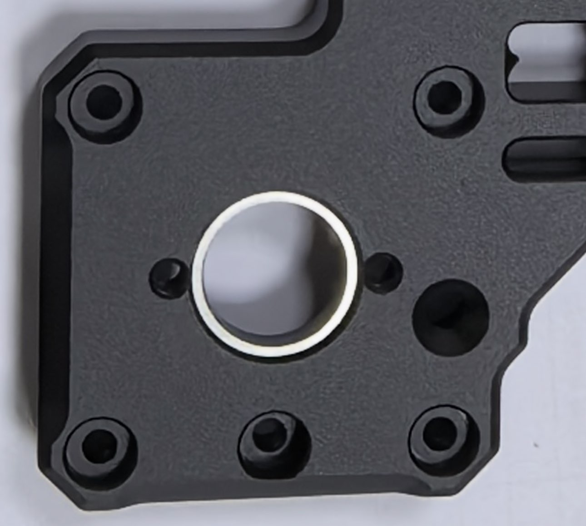

# Batch 1 Notes

Batch 1 has two separate documented issues:

- Flanged-bearing hole depth issue: factory shim correction, no normal builder action.
- Stepper screw engagement issue: washer guidance for affected stepper installations.

## Issue 1: Flanged-bearing Hole Depth

### LDO Announcement: Flanged-Bearing Hole Depth Issue

JasonFromLDO, March 12, 2026

#### Update on the Monolith CNC Gantry Kits

Dear valued customers and partners,

During the conversion to internal production files, the depth of certain component holes was incorrectly specified. A mistake that wasn't present in the original package we received from the designer. Unfortunately, it was only discovered after the production was completed. LDO takes full responsibility for this issue and the delay.

We know many of you have been eagerly awaiting this release, and we sincerely apologize for the delay. A solution has already been implemented for the manufacturing issue. Everything is now on track, and we are working diligently to ensure you receive your kits as soon as possible.

Estimated shipping time from China will be the end of March or early April, and arrival at resellers around the end of April. Thank you for your patience and continued support. Most our resellers will start to take pre-order after we make the shipment.

Thank you for your attention for this matter.

LDO Team  
March 12, 2026

### Shim Correction and Builder Action

The affected Batch 1 parts arrive with the correction shims already glued in under the flanged bearings. These shims correct the bearing pocket depth issue named in the LDO announcement above.

There is no normal builder action here. Do not add, remove, or move the glued-in shims during assembly. Any separately packaged shims included with the kit are spares in case one is ever needed, not parts to install during a normal build.

Reference image:

## Issue 2: Stepper Screw Engagement

Some Batch 1 stepper mounting screws may engage too deeply, depending on the motor's threaded-hole depth. This can affect steppers with more limited hole depths than the most common 48 mm body LDO steppers.

Use M3 spring washers, or another small-OD M3 washer, in the stepper mounting hole counterbores to avoid this issue. These washers are separate from the factory-installed flanged-bearing shims described above.

LDO worked to get these washers to resellers and to include them in Batch 1 kits that had not shipped yet.
