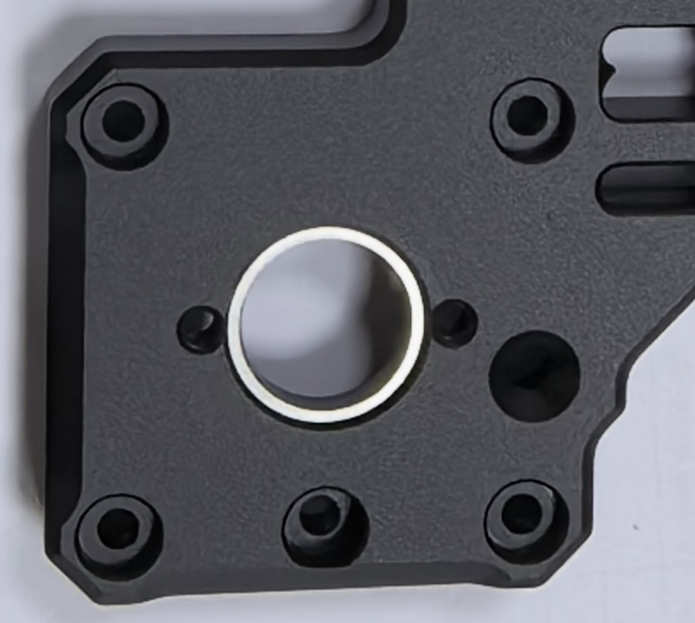

# Batch Notes

Read these before assembly. If a note is not listed for your batch, do not assume an older issue still applies.

## Batch 2

- Stepper screw engagement: fixed with flat head screws.
- Live-shaft bearings: come pre-installed with Loctite 641 medium strength retaining compound, a grade made for serviceable fits, as an interface between the anodized aluminum parts and the bearings, with the axial preload unchanged from Batch 1.

No user action is needed.

## Batch 1

- Flanged-bearing hole depth: corrected at the factory with shims glued in under the bearings. No builder action, and any separately packaged shims are spares.
- Stepper screw engagement: use M3 spring washers, or any other small-OD M3 washers, in the stepper mounting counterbores. This affects steppers with shallower threaded holes than the common 48 mm body LDO motors.

### LDO Announcement: Flanged-Bearing Hole Depth Issue

JasonFromLDO, March 12, 2026

#### Update on the Monolith CNC Gantry Kits

Dear valued customers and partners,

During the conversion to internal production files, the depth of certain component holes was incorrectly specified. A mistake that wasn't present in the original package we received from the designer. Unfortunately, it was only discovered after the production was completed. LDO takes full responsibility for this issue and the delay.

We know many of you have been eagerly awaiting this release, and we sincerely apologize for the delay. A solution has already been implemented for the manufacturing issue. Everything is now on track, and we are working diligently to ensure you receive your kits as soon as possible.

Estimated shipping time from China will be the end of March or early April, and arrival at resellers around the end of April. Thank you for your patience and continued support. Most our resellers will start to take pre-order after we make the shipment.

Thank you for your attention for this matter.

LDO Team  
March 12, 2026
