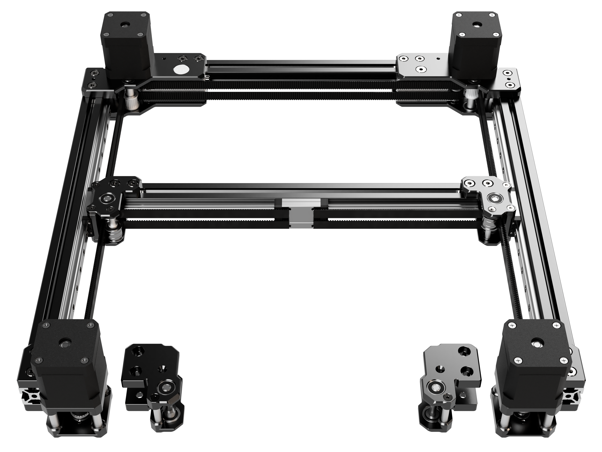

# LDO Monolith Gantry Kits

Official milled [Monolith Gantry](https://github.com/Monolith3D/Monolith_Gantry) kits for Voron V2 and Voron Trident, manufactured by [LDO](https://ldomotion.com/).

These kits provide the CNC/milled parts and supporting hardware needed to build a Monolith Gantry in a reseller-ready package. They support both 2WD and AWD configurations for the selected printer variant, but the best configuration depends on the rest of the machine.

## Start Here

<a href="https://build.monolith3d.xyz/">
  <picture>
    <source media="(prefers-color-scheme: dark)" srcset="https://raw.githubusercontent.com/Monolith3D/MISC/main/Common_repo_files/monolith-builder-dark.png">
    <source media="(prefers-color-scheme: light)" srcset="https://raw.githubusercontent.com/Monolith3D/MISC/main/Common_repo_files/monolith-builder-light.png">
    
  </picture>
</a>

Before ordering parts or starting assembly, choose the correct path:

1. Choose the correct [kit variant](#what-is-included): V2 or VT.
2. Choose the [drive layout](#choosing-2wd-or-awd): 2WD or AWD.
3. Choose the [fit/clearance layout](#np-and-ft): NP or FT.
4. Check [toolhead and carriage compatibility](#toolhead-compatibility).
5. Choose the [homing setup](https://github.com/Monolith3D/Toolheads_for_Monolith/tree/main/Design_Guidelines#clearance-and-endstops): switches or sensorless.
6. Check the [printed parts and shared files](#printed-parts-and-shared-files).
7. Confirm [stepper compatibility](#steppers) and belt choice.
8. Open the correct manual and check [batch notes](#batch-notes).

Find the assembly manuals in [Docs](Docs/).

## Vendors

US: [West3D](https://west3d.com/products/monolith-cnc-gantry-by-ldo-systems-v2-4-and-trident-compatible-with-2wd-and-awd), [Fabreeko](https://www.fabreeko.com/products/monolith-gantry-cnc-kit-by-ldo), [KB-3D](https://kb-3d.com/store/).

Canada: [3D Lab Tech](https://www.3dlabtech.ca/product/ldo-monolith-cnc-gantry-kit/).

Australia: [Dremc](https://store.dremc.com.au/products/ldo-monolith-cnc-gantry-kit-v2-4-trident?_pos=2&_sid=165a04a36&_ss=r).

UK: [123-3D](https://www.123-3d.co.uk/), [onetwo3D](https://www.onetwo3d.co.uk/product/ldo-monolith-gantry-kit/).

Germany: [3DPartner](https://www.partner-3d.de/3d-druck-ersatzteile/).

France: [MyRigs](https://myrigs3d.com/).

Hungary: [Zen3D Laboratories](https://shop.zen3d.eu/cnc-monolith-gantry).

Russia: [RRF3D](https://rrf3dshop.ru/catalog/mekhanika/motory/).

India: [DConqueror3D](https://dc3d.in/).

## What is Included

The kit includes the milled gantry parts and supporting hardware for the selected printer variant.

Key kit features:

- CNC/milled Monolith Gantry parts
- Parts for both 2WD and AWD configurations
- Robust removable tensioners for belting and pre-tensioning
- 9/10 mm belt support, depending on toolhead compatibility
- Genuine Gates pulleys and press-fit live-shaft idlers
- AWD front extrusion support for tool changer setups

The kit does not include belts, steppers, toolhead, probe, electronics, printer-specific frame or panel upgrades, or firmware mods.

## Printed Parts and Shared Files

Kit-specific prints, helper tools, and shared Monolith Gantry STL links are listed in [STLs](STLs).

The user manuals show where these printed parts and helper tools are used during assembly.

## Choosing 2WD or AWD

These kits are intended for standard 250-350 mm bed sizes.

2WD is the safer starting point for stock or lightly modified machines, especially with printed or modular toolheads, stock panels, or a frame that has not been stiffened.

AWD is most useful when the rest of the printer is ready to benefit from the added belt stiffness. That means the frame, panels, toolhead, and X-rail all need to support the higher-stiffness path.

> [!NOTE]
> AWD is not automatically better for every printer. On a less rigid machine, 2WD is probably the better configuration.

The user manuals show the configuration-specific 2WD and AWD assembly paths.

## Steppers

LDO 2504 Speedy Power steppers are the known-good baseline for this kit. LDO 2504 S45R "Monolith Edition" steppers are commonly bundled with the kits, and their shaft length is compatible across the Monolith Gantry platform.

Alternate NEMA17 steppers may work, but the stepper shafts need to be 5 mm in diameter and at least 37 mm long to work with the kit in double-shear. 8 mm shaft diameter can work, but only in single-shear.

Some Batch 1 kits may have documented stepper screw engagement problems. Check the [batch notes](#batch-notes) before installing motors.

## NP and FT

NP means No Protrusion. It keeps the gantry inside the stock frame or panel footprint by moving the relevant mounts and belt path inward.

FT means Full Travel. It prioritizes travel, but it may require clearance changes around panels, doors, or vertical extrusions.

Physical fit and performance recommendation are separate questions. A layout can fit inside the printer and still be the wrong performance path if the rest of the machine cannot use the added stiffness.

The user manuals include the detailed NP and FT layout explanation, clearance notes, and spacer placement.

## Toolhead Compatibility

See [Toolheads for Monolith](https://github.com/Monolith3D/Toolheads_for_Monolith) for compatible toolheads, belt clamps, and guidance on stiffness, clearance, and endstops.

## Rail Notes

The LDO milled XY-joints use MGN9H Y-carriages. Z0 / no preload is recommended for the Y-rails to avoid extra wear or binding. Other preload classes can work.

For the separate X-rail recommendation, see the [toolhead design guidelines](https://github.com/Monolith3D/Toolheads_for_Monolith/tree/main/Design_Guidelines#stiffness-and-center-of-mass).

## Batch Notes

Check the [batch notes](Docs/batch_notes.md) before assembly.

## Support

For kit hardware defects or missing kit hardware, use the LDO or reseller support path.

For Monolith design, configuration, and documentation questions, use the Monolith documentation and community channels.

For third-party toolheads, probes, electronics, or firmware behavior, check the relevant upstream project.

## Credit and Attribution

**Designer**  
CloakedWayne

**Project Coordinator**  
JasonFromLDO

**Design Consultant**  
DaveFromLDO  
Scarecrow  
The_Adeo

**Production**  
LDO Motors

**Testing**  
Brazuka  
The_Adeo  
Scarecrow  
Zakfarias  
SyNoon  
JoseFromLDO us  
Kittie Katt  
Reth  
JaredC01  
Tae  
TheVoronModder
